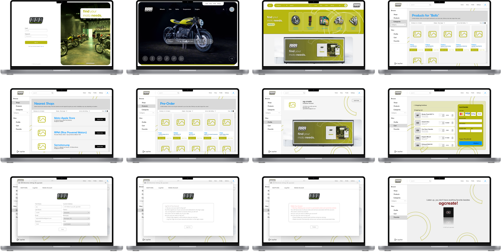
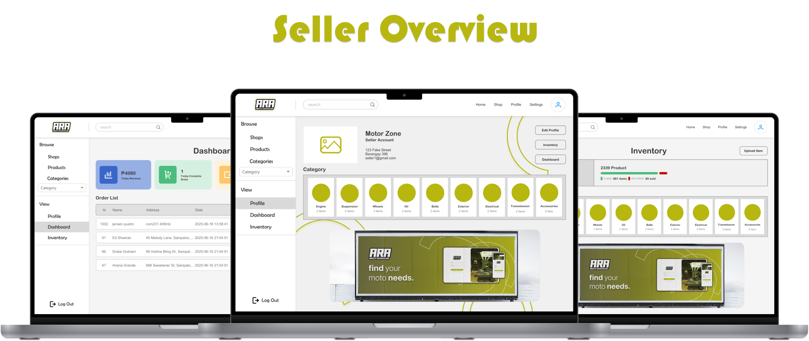
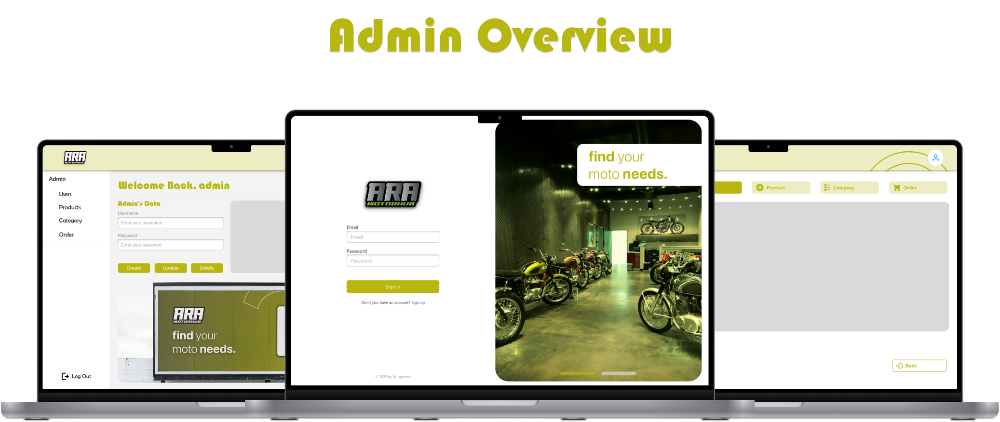
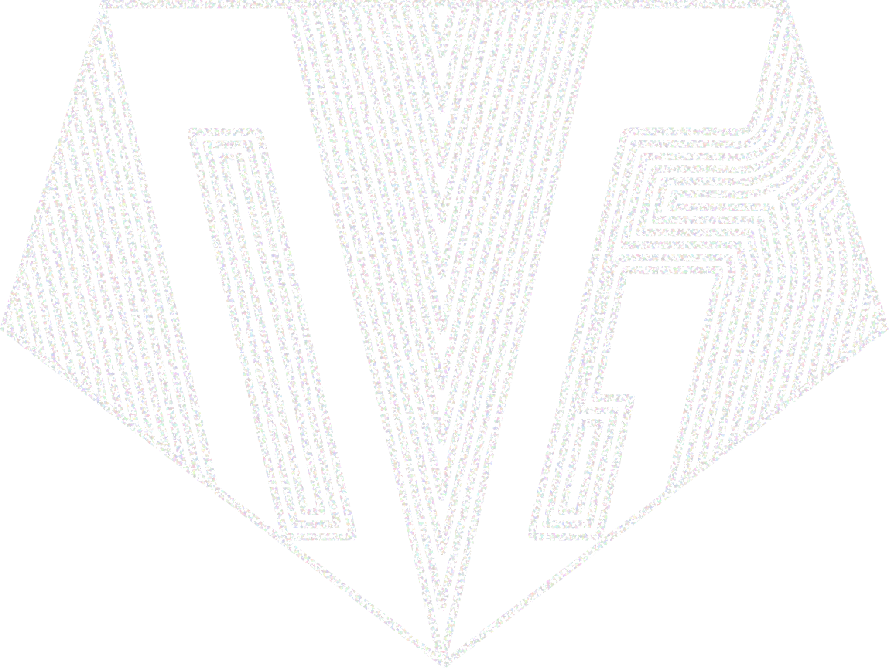

<div align="center">
  
</div>

---
>**find** your  
>motor **needs.**
---

## Table of Contents

<<<<<<< HEAD
- 🚀 [Project Overview](#-project-overview)
- 🛠️ [How to Run](#️-how-to-run)
- ⚙️ [Technologies Used](#-technologies-used)
- ✨ [Features](#-features)
  - 🔧 [Admin Side](#-admin-side)
  - 🎯 [User Side](#-user-side)
- 📦 [Project Structure](#-project-structure)
- 📸 [Screenshots](#-screenshots)
- 🤝 [Developer](#-developer)
- 📬 [Contact / Support](#-contact--support)
=======
- [Table of Contents](#table-of-contents)
- [🚀 Project Overview](#-project-overview)
- [⚙️ Technologies Used](#️-technologies-used)
- [✨ Features](#-features)
  - [🔧 Admin Side](#-admin-side)
  - [🎯 User Side](#-user-side)
- [📸 Screenshots](#-screenshots)
- [🤝 Developer](#-developer)
- [🏗️ Project Structure](#️-project-structure)
- [📬 Contact / Support](#-contact--support)


>>>>>>> de4ebe3d639d9d399a8e4095182e6d584c2b366d
---

## 🚀 Project Overview

**ARA Motorhub** A desktop application for managing motorcycle parts inventory. Customers can browse parts, request items, and check availability across multiple stores. Includes dedicated admin and seller dashboards for efficient stock control. Backed by a MySQL database server via XAMPP and phpMyAdmin.

<<<<<<< HEAD
🎓 *This project was created as a final requirement in our Advanced Database Systems course.*
---

## 🛠️ How to Run

> 🔔 **Note:** Make sure Java 17+ and Maven are installed. JavaFX libraries are automatically handled by Maven.

### ✅ Prerequisites:
- Java JDK 17+
- Apache Maven (i have maven 8.9.11)
- MySQL Server / XAMPP

### 📦 Steps to Run:
1. **Clone the repository:**
   ```bash
   git clone https://github.com/OG-CZ/aramotorhub.git
   cd ogcreate-aramotorhub

2. **Setup Database:**
- Import the SQL file from /sql-database/ into phpMyAdmin or MySQL Workbench.

3. **Configure Database Connection:**
- Open DatabaseConnection.java under:
  ```bash
  src/com/ogcreate/app/database/DatabaseConnection.java
- Update with your local database credentials (host, db name, user, password).

4. **Run the app using Maven in the terminal:**
   ```bash
    mvn clean javafx:run

5. **✅ Enjoy!**


---

## ⚙️ Technologies Used

- 💻 Java Programming Language
- 🎨 JavaFX (UI Framework)
- 🧩 Maven (Build & Dependency Management)
- 🧱 FXML (Declarative UI)
- 🎨 CSS for Styling
- 🛠️ SceneBuilder (for designing UI visually)
- 🗃️ MySQL (Database)
- 🧪 XAMPP with phpMyAdmin (Local DB Server)
=======
This was our finals in Advanced Database Class.

> ⚙️ **Built using the JavaFX framework** a modern GUI toolkit for Java that provides structure, reusable components, and declarative UI design. Think of it as a structured environment (a framework) that gives you both flexibility and power to create rich desktop apps.


## ⚙️ Technologies Used

- Java Language
- JavaFX UI Framework
- Scenebuilder (for desinging UI Visually)
- FXML (for declarative UI design)
- CSS
>>>>>>> de4ebe3d639d9d399a8e4095182e6d584c2b366d

---

## ✨ Features

### 🔧 Admin Side
- 🔁 Full CRUD operations:
  - Manage Admins, Users, Stores
  - Manage Inventory, Products, Categories
- 🗃️ Stock Management: No Stock, Available, Cart, etc.

### 🎯 User Side
- 📝 Step 1 & 2 Registration
- 🏠 Customer Home Pages
- 🛒 Buying Process:
  - Search & Filter Products
  - Add to Cart (with Spinner Quantity)
  - View Seller Shops
  - Checkout with Card Payment

---

## 📸 Screenshots

<br>

<div align="center">
  
</div>

<br>

<div align="center">
  
</div>

<br>
<br>

<div align="center">
  
</div>

<br>
<br>

<div align="center">
  
</div>

---

## 🤝 Developer

<div align="center">
  <table>
    <tr>
      <td width="200" align="center" valign="top">
        
        <p>
          <strong>Carl Zeus Anastacio</strong><br/>
          <em>Project Lead • Project Manager • UI/UX Designer • Front-end Developer • Back-end Developer • Documentation • Database Designer</em>
        </p>
      </td>
  </table>
</div>

---

## 🏗️ Project Structure

<pre> <code>
ogcreate-aramotorhub/
├── README.md
├── ARAMotorhub/
│   ├── bin/
│   │   ├── com/
│   │   │   └── ogcreate/
│   │   │       └── app/
│   │   │           ├── controllers/
│   │   │           │   ├── admin/
│   │   │           │   ├── auth/
│   │   │           │   ├── customer/
│   │   │           │   ├── settings/
│   │   │           │   └── store/
│   │   │           └── database/
│   │   └── resources/
│   │       ├── assets/
│   │       ├── css/
│   │       ├── fonts/
│   │       └── fxml/
│   │           ├── admin/
│   │           ├── auth/
│   │           ├── customer/
│   │           ├── settings/
│   │           └── store/
│   ├── lib/
│   ├── src/
│   │   ├── com/
│   │   │   └── ogcreate/
│   │   │       └── app/
│   │   │           ├── controllers/
│   │   │           │   ├── admin/
│   │   │           │   ├── auth/
│   │   │           │   ├── customer/
│   │   │           │   ├── settings/
│   │   │           │   └── store/
│   │   │           └── database/
│   └── resources/
│       ├── assets/
│       ├── css/
│       ├── fonts/
│       └── fxml/
│           ├── admin/
│           ├── auth/
│           ├── customer/
│           ├── settings/
│           └── store/
│   └── .vscode/
├── readme/
└── sql-database/
</code> </pre>

---

## 📬 Contact / Support

For inquiries, suggestions, or support, please contact:

- **Instagram**: [@_ogcz](https://www.instagram.com/_ogcz/)
- credits to @leon for this readme format

--- 

Let me know if you want this auto-formatted and placed directly into your repo’s `README.md`, or if you'd like additional badges or license section (MIT, etc.) added.

Also: if you ever want to **convert this to a `.exe`**, you can later explore `jpackage` (built-in JDK tool), but for now, Maven is perfect for sharing.
